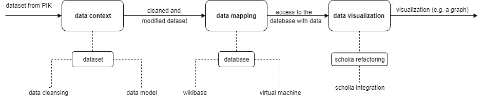

# Code Openness
The code-openness project is part of the [Coding Openness Software Project](https://www.mi.fu-berlin.de/en/inf/groups/hcc/teaching/summer_term_2019/coding-openness.html) led by [Prof. Müller-Birn](https://www.clmb.de/index.html) and her Research Group, [Human-Centered Computing](https://www.mi.fu-berlin.de/en/inf/groups/hcc/index.html), at the Freie Universität Berlin, in cooperation with the Potsdam Institute for Climate Impact Research ([PIK](https://www.pik-potsdam.de/pik-frontpage)).

## Open Climate Library
In this project, we received a dataset containing the bibliographic information from the scientific library for climate science. This dataset contained about 8,000 entries and was to be transferred to the Wikidata format, allowing for further analysis and processing. 
Initially, it was essential to assess the Wikidata and Wikimedia software for its potential as a source and tool environment for data analysis. It was followed, by the visualization of the data set from its Wikidata format, with the data visualization tool "Scholia." Therefore, the project aimed to make the bibliographic data, of the Potsdam Climate Impact Research Institute, available in an independent Wikibase environment via a GUI and SPARQL Query Service, resulting in its visualization via Scholia. 
The group sub-divided into three further groups: data context, data mapping, and data visualization. 
The connection between the three groups is as follows:

The project is based on Free/Libre Open Source software. Thus, all applied software has been kept open-source; for example, communication was handled via Riot.im, an open-source communication software. All code is written and used during the project can be found on the following GitHub Organisation page.

[View Project on GitHub](https://github.com/code-openness){: .btn .btn-green }
